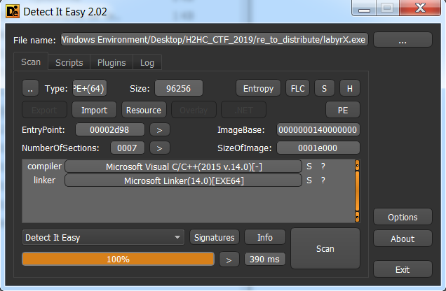
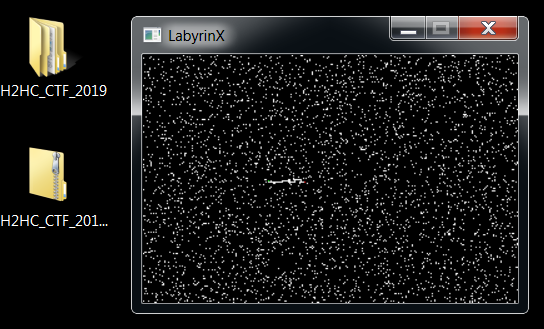
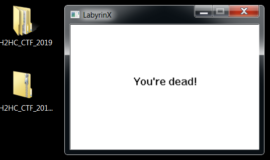
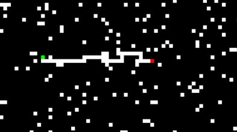
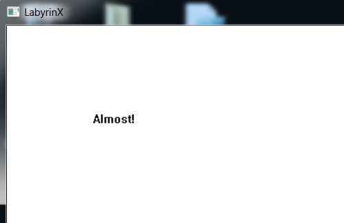

# LabyrX

Obs: ELT2 team (dayrell, g3ol4do, Manoel e n0ps13d) solution.

## Challenge introduction

We received the file LabyrX.exe, a **PE** binary, with the following features.



**Figure 1. Challenge binary features**

## Reversing the binary

We start doing dynamic analysis on the binary.
Running it, a small window opens. 
Figure 2 presents this window. 
We tested interact with it using the keyboard and realized some behaviors.
Pressing **R** the canvas reloads and pressing the arrow keys seems to interact, but we could not see its effect.



**Figure 2. Window presented by the running program**

Some of the arrow keys produced a **“You’re dead!”** message as shown on figure 2.
Despite our intuition these keys moved the player in the maze, no change were perceived.


 
**Figure 3. Returned message after pressing some arrow keys**

After some dynamic analysis, we decided to start static analysis.
The following explanation is based on the finished analysis.

### _WinMain_ function:

_WinMain_ function instantiates and configures an object, whose struct is called  _labyrinth_, and sets and presents the program window.
The most important snippets from the already analyzed code are presented in snippet 1.
The most important functions called by _WinMain_ are bold.

<pre><code>
int WinMain()
{
  ...
  obj_ptr = (labyrinth *)HeapAlloc(v4, 8u, 0x440ui64);
  if ( !obj_ptr )
    return GetLastError();
  <b>set_params</b>(obj_ptr);
  <b>wrap_set_labbytes</b>(obj_ptr);
  memset(&v7.style, 0, 0x4Cui64);
  ...
  v7.lpfnWndProc = (WNDPROC)<b>iteration</b>;
  ...
  v7.lpszClassName = (LPCWSTR)obj_ptr->class_name;
  ...
  hWnd = CreateWindowExW(
           0x200u,
           (LPCWSTR)obj_ptr->class_name,
           (LPCWSTR)obj_ptr->xor_key,
           . . .
           obj_ptr->block_size * obj_ptr->width,
           obj_ptr->block_size * obj_ptr->height,
           . . .
           0i64);
  if ( !hWnd )
    return GetLastError();
  ShowWindow(hWnd, nCmdShow);
  <b>print_canvas</b>(hWnd);
  UpdateWindow(hWnd);
  ...
}
</code></pre>

**Snippet 1. _WinMain_ function snippet**

### _set_params_ function:

_set_params_ function sets the _labyrinth_ attributes.
The function sets the initial coordinates, the target coordinates, the moves counter and the encoded path.
All these settings are bold.
Besides that, the function also sets the block size in pixels, the key xored with the encoded path and the maze width and height.

<pre><code>
labyrinth * set_params(labyrinth *this)
{
  obj_ptr = this;
  this->block_size = 1;
  this->win_flag = 0;
  this->dead_flag = 0;
  <b>this->moves_counter = 0;</b>
  this->unknown_yet0 = 0;
  this->width = 320;
  this->height = 240;
  <b>this->x = 100;</b>
  <b>this->y = 100;</b>
  <b>this->target_x = 129;</b>
  <b>this->target_y = 101;</b>
  obj_ptr->prev_x = obj_ptr->x;
  obj_ptr->prev_y = obj_ptr->y;
  this->last_move_code = 0;
  this->class_name = (char *)aLabyclass;
  this->maybe_canvas_printed_flag = 0;
  this->xor_key = (char *)aLabyrinX;
  <b>set_to_zero(this->encoded_path, 1000ui64);</b>
  result = obj_ptr;
  ...
  return result;
}
</code></pre>

**Snippet 2. set_params function snippet**

Identifying _block_size_ variable allowed us to patch the binary and turn the maze wider.
The _block_size_ value was changed from 1 to 5 and its result is presented in figure 3.
The green point represents the player and the red point represents the target.


 
**Figure 4. Maze with _block_size_ = 5**

After turning the maze wider, the solution seemed easy: move the player to the target.
We did that and were surprised by the message **“Almost!”** as presented in figure 4.
After frustration, we returned to static analysis to understand the binary better and get the desired _flag_.



**Figure 5. Message presented after reaching the target**

### _print_canvas_ function:

_print_canvas_ function prints the maze, update the player position after each move and prints the ending game messages (**“You’re dead!”**, **“Almost!”** e a _flag_).
The function snippet of our interest is presented below.

<pre><code>
int print_canvas(HWND a1)
{
  ...
  if ( <b>obj_ptr->win_flag == 1</b> )
  {
    result = (signed int)obj_ptr;
    if ( obj_ptr->unknown_yet0 != 2 )
    {
      qmemcpy(chText, aAlmost, sizeof(chText));
      ...
      Buf1 = 0;
      memset(&v21, 0, 0x1Fui64);
      <b>sha256_setup</b>((__int64)&v19);
      <b>sha256_ins_message</b>((__int64)&v19, (__int64)obj_ptr->encoded_path, obj_ptr->moves_counter / 4);
      <b>sha256_calc_hash</b>(&v19, (__int64)&Buf1);
      if ( !memcmp(&Buf1, hash_ref, 0x20ui64) )
      {
        for ( m = 0; m < obj_ptr->moves_counter / 4; ++m )
          *((_BYTE *)chText + m) = obj_ptr->encoded_path[m] ^ obj_ptr->xor_key[m];
      }
      calc_flag_len = -1i64;
      do
        ++calc_flag_len;
      while ( chText[calc_flag_len] );
      result = DrawTextW(hDC, (LPCWSTR)chText, calc_flag_len, &rc, 0);
    }
  }
  ...
}
</code></pre>

**Snippet 3. _print_canvas_ function snippet**

The three bold functions are important.
They hash the encoded path.
The _maybe_sha256_setup_ function inserts the hash **IV**.
The encoded path hash is compared with _hash_ref_.
If it is equal, the encoded path is xored with the _labyrinth_ object _xor_key_ and the result is printed.
_xor_key_ is an **UTF-16** string.

### _iteration_ function:

_iteration_ function receives and processes window messages.
The function snippet of our interest is presented below.

<pre><code>
LRESULT iteration(HWND hwnd, UINT uMsg, WPARAM wParam, LPARAM lParam)
{
  ...
  switch ( uMsg )
  {
    ...
    case 0x100u:
      <b>move_avatar</b>((__int64)hwnd, wParam);
      <b>print_canvas</b>(hWnd);
      break;
    default:
      return DefWindowProcW(hwnd, uMsg, wParam, lParam);
  }
  return 0i64;
}
</code></pre>

**Snippet 4. _iteration_ function snippet**

The two bold functions are important.
The _print_canvas_ function has already been analyzed.
The _move_avatar_ function updates the _labyrinth_ object based on the message sent to the window.
After updating the object, _print_canvas_ the changes are reflected in the window _pixels_.

### _move_avatar_ function:

The _move_avatar_ function snippet of our interest is presented below.
It updates the object based on the pressed key.
Pressing the arrow keys moves the player in the maze and the _update_obj_ function is called with different arguments.

<pre><code>
labyrinth * move_avatar(__int64 a1, __int64 a2)
{
  ...
  switch ( a2 )
  {
    ...
    case 37i64:                                 // Left key
      result = (labyrinth *)<b>update_obj</b>(1);
      break;
    case 38i64:                                 // Key up
      result = (labyrinth *)<b>update_obj</b>(2);
      break;
    case 39i64:                                 // Key right
      result = (labyrinth *)<b>update_obj</b>(0);
      break;
    case 40i64:                                 // Key down
      result = (labyrinth *)<b>update_obj</b>(3);
      break;
    case 82i64:                                 // Key R
      wrap_set_labbytes(obj_ptr);
      result = set_params(obj_ptr);
      break;
    default:
      return result;
  }
  return result;
}
</code></pre>

**Snippet 5. _move_avatar_ function snippet**

### _update_obj_ function:

_update_obj_ function updates the _labyrinth_ object according to its argument.
The snippet of our interest is presented below.

<pre><code>
__int64 update_obj(int move_code)
{
  ...
  if ( move_code )
  {
    switch ( move_code )
    {
      case 1:
        --obj_ptr->x;
        break;
      case 2:
        --obj_ptr->y;
        break;
      case 3:
        ++obj_ptr->y;
        break;
    }
  }
  else
  {
    ++obj_ptr->x;
  }
  if ( <b>obj_ptr->x == obj_ptr->target_x && obj_ptr->y == obj_ptr->target_y</b> )
    obj_ptr->win_flag = 1;
  ...
  if ( code & 1 )
    _bittestandset((signed __int32 *)obj_ptr->encoded_path, 2 * obj_ptr->moves_counter);
  if ( code & 2 )
    _bittestandset((signed __int32 *)obj_ptr->encoded_path, 2 * obj_ptr->moves_counter + 1); 
  obj_ptr->moves_counter = (unsigned int)(obj_ptr->moves_counter + 1);
}
</code></pre>

**Snippet 6. _update_object_ function snippet**

The function updates the object coordinates according to the pressed arrow key.
Besides that, if the player reaches the target, _win_flag_ is set.
Lastly, the code two least significant _bits_ are added to the encoded path and the moves counter is incremented.

### Program analysis recap:

After analyzing the program, we know the _print_canvas_ snippet which prints the _flag_.
It is only executed when the player reaches the target, which is represented by a red point on the maze.
Therefore, that is not enough.
Besides reaching the target, the encoded path _hash_ must be equal to _hash_ref_, that is, the _flag_ is only printed if the player walks the correct path.

## Finding the correct path

To solve the challenge, we assumed the _flag_ is an **UTF-16** _string_, is 16 _bytes_ long and has only printable **ASCII** characters.
As _xor_key_ also has those features, the encoded path must have the two first features and match the following hexadecimal pattern:

**aa** 00 **bb** 00 **cc** 00 **dd** 00 **ee** 00 **ff** 00 **gg** 00 **hh** 00,

where aa, bb, cc, dd, ee, ff, gg, hh values are in 00-7f range and the other _bytes_ are 00.

As each move adds 2 _bits_ into the encoded path, each _byte_ represents 4 moves and the expected path has 64 moves.
As the odd-index _bytes_ (first index is zero) are 00, 4 arbitrary moves are followed and follow 4 moves to the right (0 is the argument to _update_obj_, when the right arrow key is pressed).

All those constraints reduce the space of possible paths in the maze between the initial and the target positions, making feasible list all encoded paths meeting them.
They were expressed in the Python _script_ in snippet 7.
lab.txt content is presented in snippet 8.

```python
from queue import LifoQueue
from re import findall

fout = open(‘keys’, ‘wb’)

lab = open(‘lab.txt’).read().split(‘\n’)

q = LifoQueue(maxsize=10000)

q.put((0, 0, 2, ‘’))

d = {‘R’: ‘00’, ‘L’: ‘01’, ‘U’: ‘10’, ‘D’: ‘11’}

def ll(c):
    return c == ‘*’ or c == ‘E’

def ptrace(t):
    bb = [ x[::-1] for x in findall(‘.{4}’, t) ]
    new_bb = ‘’.join([ ‘’.join([ d[y] for y in x ]) for x in bb ])
    text = ‘’.join([chr(int(x, 2)) for x in findall(‘.{8}’, new_bb)])
    #print text
    fout.write(text + ‘\n’)

while q.qsize() > 0:
    it, x, y, trace = q.get()
    #print trace

    if it > 64:
        continue
    if lab[y][x] == ‘E’:
        if it == 64:
            ptrace(trace)
        continue

    if (it-4) % 8 == 0:
        if ll(lab[y][x+1]) and ll(lab[y][x+2]) and ll(lab[y][x+3]) and ll(lab[y][x+4]):
            q.put((it+4, x+4, y, trace + ‘RRRR’))
        continue

    if x > 0 and ll(lab[y][x-1]):
        q.put((it+1, x-1, y, trace + ‘L’))
    if y > 0 and ll(lab[y-1][x]):
        q.put((it+1, x, y-1, trace + ‘U’))
    if x < len(lab[0])-1 and ll(lab[y][x+1]):
        q.put((it+1, x+1, y, trace + ‘R’))
    if y < len(lab)-1 and ll(lab[y+1][x]):
        q.put((it+1, x, y+1, trace + ‘D’))

print “End!”
fout.close()
```

**Snippet 7. Python script which generates all encoded paths that meet the constraints**

```
....................*.............
................**..*******.......
*.*........*******...*....*.......
************....******...****E....
....**...........*.......*........
..................................
..................................
```

**Snippet 8. lab.txt content**

After running the Python _script_, all encoded paths are saved in the _key_ file.
This file was used as hashcat _wordlist_ and we found the right encoded path, as presented below.

<pre><code>
Session….......: hashcat
Status…........: <b>Cracked</b>
Hash.Type….....: SHA2-256
Hash.Target…...: 5760e06762ee966aea91af3f3af98489629a63393d029131dee…693778
Time.Started…..: Sun Oct 27 02:46:52 2019 (0 secs)
Time.Estimated…: Sun Oct 27 02:46:52 2019 (0 secs)
Guess.Base…....: File (D:\Users\Manoel\Documents\CTF\2019\H2HC\keys)
Guess.Queue…...: 1/1 (100.00%)
Speed.#3…......: 10262.0 kH/s (2.83ms) @ Accel:1024 Loops:1 Thr:64 Vec:1
Recovered….....: 1/1 (100.00%) Digests, 1/1 (100.00%) Salts
Progress…......: 1092960/1092960 (100.00%)
Rejected…......: 0/1092960 (0.00%)
Restore.Point….: 983040/1092960 (89.94%)
Restore.Sub.#3…: Salt:0 Amplifier:0-1 Iteration:0-1
Candidates.#3….: $HEX[3b005100450054001200c400ae007c00] -> $HEX[3b005500550005002000c100a1007c00]
Hardware.Mon.#3..: Temp: 53c Util: 11% Core:1176MHz Mem:2505MHz Bus:8
</code></pre>

**Figure 6. hashcat output**
	
We xored the encoded path with **“LabyrinX”** (_xor_key_) and found the desired _flag_: **w4y-0ut$**.

