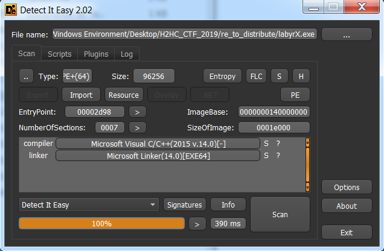
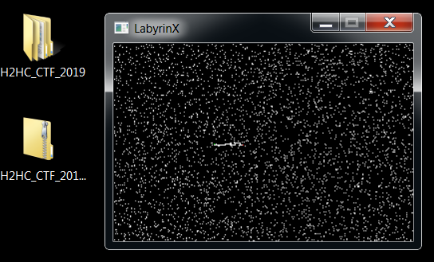
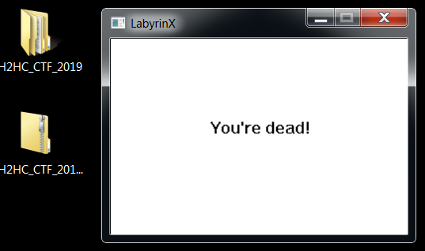
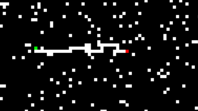
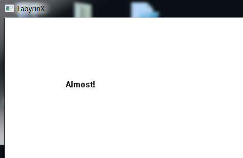

# LabyrX

Obs: Esta solução foi desenvolvida pelo time ELT2 (dayrell, g3ol4do, Manoel e n0ps13d).

## Introdução do desafio

Nós recebemos o arquivo LabyrX.exe, um binário **PE**, com as seguintes características.



**Figura 1. Características do binário do desafio**

## Entendendo o funcionamento do programa

A primeira abordagem foi realizar análise dinâmica para entender o funcionamento do programa.
Ao executar o programa, uma pequena janela é aberta. 
A figura 1 apresenta essa janela. 
Nós testamos interagir com a janela usando o teclado e percebemos alguns detalhes.
A tecla **R** recarregava a imagem da janela e as setas do teclado também pareciam interagir, mas não estava evidente quais eventos elas provocavam.



**Figura 2. Janela apresentada ao executar o programa**

Algumas teclas geravam a mensagem **“You’re dead!”** como é mostrado na figura 2.
Apesar de termos a intuição de que as setas movimentariam algo, nenhuma alteração na imagem da janela foi percebida.


 
**Figura 3. Mensagem retornada após pressionar algumas das setas do teclado**

Após tentar extrairmos alguma informação por meio de análise dinâmica, partimos para a análise estática.
Para resumir essa explicação, não a conduzirei por todos os detalhes da resolução.
A explicação basear-se-á no resultado da análise estática do binário.

### Função _WinMain_:

A função _WinMain_ basicamente instancia e configura um objeto, cuja estrutura é chamada de _labyrinth_, e inicializa e apresenta a janela do programa.
Os trechos mais importantes do código já analisado dessa função são apresentados no código 1.
As funções chamadas por _WinMain_ mais importantes estão marcadas.

<pre><code>
int WinMain()
{
  ...
  obj_ptr = (labyrinth *)HeapAlloc(v4, 8u, 0x440ui64);
  if ( !obj_ptr )
    return GetLastError();
  <b>set_params</b>(obj_ptr);
  <b>wrap_set_labbytes</b>(obj_ptr);
  memset(&v7.style, 0, 0x4Cui64);
  ...
  v7.lpfnWndProc = (WNDPROC)<b>iteration</b>;
  ...
  v7.lpszClassName = (LPCWSTR)obj_ptr->class_name;
  ...
  hWnd = CreateWindowExW(
           0x200u,
           (LPCWSTR)obj_ptr->class_name,
           (LPCWSTR)obj_ptr->xor_key,
           . . .
           obj_ptr->block_size * obj_ptr->width,
           obj_ptr->block_size * obj_ptr->height,
           . . .
           0i64);
  if ( !hWnd )
    return GetLastError();
  ShowWindow(hWnd, nCmdShow);
  <b>print_canvas</b>(hWnd);
  UpdateWindow(hWnd);
  ...
}
</code></pre>

**Código 1. Código da função WinMain**

### Função _set_params_:

A função _set_params_ configura o objeto _labyrinth_.
O seu conteúdo já analisado é apresentado a seguir.
Nessa função, são configurados as coordernadas iniciais no labirinto, as coordenadas de destino do labirinto, o contador de movimentos e o caminho seguido codificado.
Todas essas configurações estão marcadas.
Além disso, também são configurados o tamanho em _pixels_ de cada posição (_block_size_), a chave usada na operação ou-exclusivo com o caminho codificado (_xor_key_) e as dimensões do labirinto (_width_ e _height_).

<pre><code>
labyrinth * set_params(labyrinth *this)
{
  obj_ptr = this;
  this->block_size = 1;
  this->win_flag = 0;
  this->dead_flag = 0;
  <b>this->moves_counter = 0;</b>
  this->unknown_yet0 = 0;
  this->width = 320;
  this->height = 240;
  <b>this->x = 100;</b>
  <b>this->y = 100;</b>
  <b>this->target_x = 129;</b>
  <b>this->target_y = 101;</b>
  obj_ptr->prev_x = obj_ptr->x;
  obj_ptr->prev_y = obj_ptr->y;
  this->last_move_code = 0;
  this->class_name = (char *)aLabyclass;
  this->maybe_canvas_printed_flag = 0;
  this->xor_key = (char *)aLabyrinX;
  <b>set_to_zero(this->encoded_path, 1000ui64);</b>
  result = obj_ptr;
  ...
  return result;
}
</code></pre>

**Código 2. Código da função set_params**

Identificar a variável _block_size_ permitiu-nos alterar o binário e gerar um labirinto mais visível.
O valor inicial foi alterado de 1 para 5 e o resultado é apresentado na figura 3.
O ponto verde representa a posição do jogador e o ponto vermelho representa a posição de destino.


 
**Figura 4. Labirinto gerado com block_size = 5**

Com o labirinto visível, a solução parecia fácil.
Bastaria seguir pelo trajeto branco usando as setas do teclado até a posição de destino.
Nós fizemos isso e fomos surpreendidos com a mensagem **“Almost!”** como apresentado na figura 4.
Após a frustração, resolvemos voltar à análise estática e entender o motivo de não termos recebido a tão desejada _flag_.



**Figura 5. Mensagem apresentada ao alcançar a posição de destino**

### Função _print_canvas_:

A função _print_canvas_ é responsável por imprimir o labirinto, atualizar a posição do jogador a cada movimento e imprimir as mensagens de fim de jogo (**“You’re dead!”**, **“Almost!”** e a _flag_).
O trecho da função do nosso interesse é apresentado a seguir.

<pre><code>
int print_canvas(HWND a1)
{
  ...
  if ( <b>obj_ptr->win_flag == 1</b> )
  {
    result = (signed int)obj_ptr;
    if ( obj_ptr->unknown_yet0 != 2 )
    {
      qmemcpy(chText, aAlmost, sizeof(chText));
      ...
      Buf1 = 0;
      memset(&v21, 0, 0x1Fui64);
      <b>sha256_setup</b>((__int64)&v19);
      <b>sha256_ins_message</b>((__int64)&v19, (__int64)obj_ptr->encoded_path, obj_ptr->moves_counter / 4);
      <b>sha256_calc_hash</b>(&v19, (__int64)&Buf1);
      if ( !memcmp(&Buf1, hash_ref, 0x20ui64) )
      {
        for ( m = 0; m < obj_ptr->moves_counter / 4; ++m )
          *((_BYTE *)chText + m) = obj_ptr->encoded_path[m] ^ obj_ptr->xor_key[m];
      }
      calc_flag_len = -1i64;
      do
        ++calc_flag_len;
      while ( chText[calc_flag_len] );
      result = DrawTextW(hDC, (LPCWSTR)chText, calc_flag_len, &rc, 0);
    }
  }
  ...
}
</code></pre>

**Código 3. Trecho de código da função _print_canvas_**

As três funções marcadas são importantes.
Elas são responsáveis pelo cálculo do _hash_ da sequência de _bytes_ do caminho codificado.
A função _maybe_sha256_setup_ insere o **IV** da função de hash.
Após o cálculo do _hash_, esse valor é comparado a _hash_ref_.
Caso o caminho percorrido seja o esperado, operação de ou-exclusivo é realizada entre os _bytes_ da sua codificação e a _xor_key_ do objeto _labyrinth_ e a sequência de _bytes_ resultante é impressa na janela.
A _string_ _xor_key_ está no formato **UTF-16**.

### Função _iteration_:

A função _iteration_ recebe as mensagens à janela e as processa.
O trecho da função do nosso interesse é apresentado a seguir.

<pre><code>
LRESULT iteration(HWND hwnd, UINT uMsg, WPARAM wParam, LPARAM lParam)
{
  ...
  switch ( uMsg )
  {
    ...
    case 0x100u:
      <b>move_avatar</b>((__int64)hwnd, wParam);
      <b>print_canvas</b>(hWnd);
      break;
    default:
      return DefWindowProcW(hwnd, uMsg, wParam, lParam);
  }
  return 0i64;
}
</code></pre>

**Código 4. Trecho da função _iteration_**

As duas funções mais marcadas são importantes.
A função _print_canvas_ já foi analisada.
A função _move_avatar_ é responsável por atualizar o objeto _labyrinth_ em função da mensagem enviada à janela.
Após essa atualização, _print_canvas_ a reflete nos _pixels_ da janela.

### Função _move_avatar_:

O trecho do nosso interesse da função _move_avatar_ é apresentado a seguir.
Ela atualiza o objeto de acordo com a tecla pressionada.
Pressionar as setas do teclado, teclas que movimentam o jogador no labirinto, provoca a execução da função _update_obj_ com argumentos diferentes.

<pre><code>
labyrinth * move_avatar(__int64 a1, __int64 a2)
{
  ...
  switch ( a2 )
  {
    ...
    case 37i64:                                 // Left key
      result = (labyrinth *)<b>update_obj</b>(1);
      break;
    case 38i64:                                 // Key up
      result = (labyrinth *)<b>update_obj</b>(2);
      break;
    case 39i64:                                 // Key right
      result = (labyrinth *)<b>update_obj</b>(0);
      break;
    case 40i64:                                 // Key down
      result = (labyrinth *)<b>update_obj</b>(3);
      break;
    case 82i64:                                 // Key R
      wrap_set_labbytes(obj_ptr);
      result = set_params(obj_ptr);
      break;
    default:
      return result;
  }
  return result;
}
</code></pre>

**Código 5. Trecho da função _move_avatar_**

### Função _update_obj_:

A função _update_obj_ atualiza o objeto _labyrinth_ de acordo com o argumento passado.
O trecho do nosso interesse da função é apresentado a seguir.

<pre><code>
__int64 update_obj(int move_code)
{
  ...
  if ( move_code )
  {
    switch ( move_code )
    {
      case 1:
        --obj_ptr->x;
        break;
      case 2:
        --obj_ptr->y;
        break;
      case 3:
        ++obj_ptr->y;
        break;
    }
  }
  else
  {
    ++obj_ptr->x;
  }
  if ( <b>obj_ptr->x == obj_ptr->target_x && obj_ptr->y == obj_ptr->target_y</b> )
    obj_ptr->win_flag = 1;
  ...
  if ( code & 1 )
    _bittestandset((signed __int32 *)obj_ptr->encoded_path, 2 * obj_ptr->moves_counter);
  if ( code & 2 )
    _bittestandset((signed __int32 *)obj_ptr->encoded_path, 2 * obj_ptr->moves_counter + 1); 
  obj_ptr->moves_counter = (unsigned int)(obj_ptr->moves_counter + 1);
}
</code></pre>

**Código 6. Trecho da função update_object**

A função atualiza as coordenadas x e y do objeto de acordo com a seta pressionada.
Além disso, caso a coordenada do jogador coincida com a do destino, a variável _win_flag_ é marcada.
Por fim, os dois _bits_ menos significativos do código passado como argumento são concatenados ao caminho codificado e o contador de movimentos é incrementado.

### Conclusão da análise estática do programa:

Após analisar estaticamente o binário, descobrimos o trecho da função _print_canvas_ responsável por imprimir a _flag_.
Para que esse trecho seja executado, o jogador precisa alcançar a coordenada de destino, marcada com a cor vermelha.
Entretanto, isso não é suficiente.
Além de alcançar o ponto de destino, o _hash_ do caminho codificado precisa ser igual a _hash_ref_, ou seja, a _flag_ só é apresentada, caso se alcance o destino seguindo o caminho correto.

## Calculando a entrada esperada pelo programa

Para resolver o desafio, nós assumimos que a _flag_ está em formato **UTF-16**, tem comprimento 16 _bytes_ e é composta apenas por caracteres **ASCII** imprimíveis.
Como a _xor_key_ também possui essas características, o caminho codificado deve possuir as duas primeiras características e respeitar o seguinte formato hexadecimal:

**aa** 00 **bb** 00 **cc** 00 **dd** 00 **ee** 00 **ff** 00 **gg** 00 **hh** 00,

onde aa, bb, cc, dd, ee, ff, gg, hh estão no intervalo 00-7f e os outros _bytes_ são 00.

Como cada movimento concatena 2 _bits_ no caminho codificado, cada _byte_ representa 4 movimentos e o caminho esperado é composto por 64 movimentos.
Como os _bytes_ em índices ímpares (o primeiro índice é zero) são 00, 4 movimentos aleatórios são alternados com 4 movimentos à direita (0 é o argumento passado à função _update_obj_, quando se pressiona a seta à direita).

As restrições relacionadas ao tamanho e ao formato foram expressas no _script_ em Python do código 7.
O conteúdo do arquivo lab.txt é apresentado no código 8.

```python
from queue import LifoQueue
from re import findall

fout = open(‘keys’, ‘wb’)

lab = open(‘lab.txt’).read().split(‘\n’)

q = LifoQueue(maxsize=10000)

q.put((0, 0, 2, ‘’))

d = {‘R’: ‘00’, ‘L’: ‘01’, ‘U’: ‘10’, ‘D’: ‘11’}

def ll(c):
    return c == ‘*’ or c == ‘E’

def ptrace(t):
    bb = [ x[::-1] for x in findall(‘.{4}’, t) ]
    new_bb = ‘’.join([ ‘’.join([ d[y] for y in x ]) for x in bb ])
    text = ‘’.join([chr(int(x, 2)) for x in findall(‘.{8}’, new_bb)])
    #print text
    fout.write(text + ‘\n’)

while q.qsize() > 0:
    it, x, y, trace = q.get()
    #print trace

    if it > 64:
        continue
    if lab[y][x] == ‘E’:
        if it == 64:
            ptrace(trace)
        continue

    if (it-4) % 8 == 0:
        if ll(lab[y][x+1]) and ll(lab[y][x+2]) and ll(lab[y][x+3]) and ll(lab[y][x+4]):
            q.put((it+4, x+4, y, trace + ‘RRRR’))
        continue

    if x > 0 and ll(lab[y][x-1]):
        q.put((it+1, x-1, y, trace + ‘L’))
    if y > 0 and ll(lab[y-1][x]):
        q.put((it+1, x, y-1, trace + ‘U’))
    if x < len(lab[0])-1 and ll(lab[y][x+1]):
        q.put((it+1, x+1, y, trace + ‘R’))
    if y < len(lab)-1 and ll(lab[y+1][x]):
        q.put((it+1, x, y+1, trace + ‘D’))

print “End!”
fout.close()
```

**Código 7. Código Python gerador de todos os caminhos codificados que atendem as restrições esperadas**

```
....................*.............
................**..*******.......
*.*........*******...*....*.......
************....******...****E....
....**...........*.......*........
..................................
..................................
```

**Código 8. Conteúdo do arquivo lab.txt**

Após executar o _script_ Python, todos os caminhos codificados cujo percurso atende as restrições foram salvos no arquivo _key_.
Esse arquivo foi usado como _wordlist_ no hashcat e nós encontramos o caminho esperado, como é apresentado na saída do hashcat a seguir.

<pre><code>
Session….......: hashcat
Status…........: <b>Cracked</b>
Hash.Type….....: SHA2-256
Hash.Target…...: 5760e06762ee966aea91af3f3af98489629a63393d029131dee…693778
Time.Started…..: Sun Oct 27 02:46:52 2019 (0 secs)
Time.Estimated…: Sun Oct 27 02:46:52 2019 (0 secs)
Guess.Base…....: File (D:\Users\Manoel\Documents\CTF\2019\H2HC\keys)
Guess.Queue…...: 1/1 (100.00%)
Speed.#3…......: 10262.0 kH/s (2.83ms) @ Accel:1024 Loops:1 Thr:64 Vec:1
Recovered….....: 1/1 (100.00%) Digests, 1/1 (100.00%) Salts
Progress…......: 1092960/1092960 (100.00%)
Rejected…......: 0/1092960 (0.00%)
Restore.Point….: 983040/1092960 (89.94%)
Restore.Sub.#3…: Salt:0 Amplifier:0-1 Iteration:0-1
Candidates.#3….: $HEX[3b005100450054001200c400ae007c00] -> $HEX[3b005500550005002000c100a1007c00]
Hardware.Mon.#3..: Temp: 53c Util: 11% Core:1176MHz Mem:2505MHz Bus:8
</code></pre>

**Figura 6. Saída do hashcat**
	
Nós realizamos operação ou-exclusivo entre o caminho codificado e **“LabyrinX”** (_xor_key_) e obtivemos a tão desejada flag: **w4y-0ut$**.

