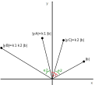

# peerreviewed

Because AES is so hard to understand, we went looking for something that is a little easier to follow. [This paper](https://dx.doi.org/10.1109/CCNC.2007.63) (DOI: 10.1109/CCNC.2007.64, [PDF](http://citeseerx.ist.psu.edu/viewdoc/download?doi=10.1.1.333.3694&rep=rep1&type=pdf)) introduces an encrypted protocol that "prevents an attacker from recovering the transmitted information through operations on the encrypted vectors exchanged during the transmission procedure" - in fact, the paper even assures us that "the only identified way one can compromise the protocol security is by applying brute force attacks". Since this is a peer-reviewed paper (by subject-matter experts, no less) we can be sure that our data is safe! My colleagues are still a bit concerned, though, so I am running this little test in order to prove that the protocol is secure.

**Total solves:** 58

**Score:** 149

**Categories:** Zahjebischte, Cryptography, Baby


## Protocol

The paper employs an unnamed protocol due to Shamir that allows one party to send a message to another without the need to previously exchange a key. Shamir's protocol only works if the message can be decrypted by applying the keys in the reverse order as used for encryption.

The requirement is satisfied, e.g., if encryption is a commuting operator. The paper chooses to "encrypt" data by representing plaintext as a point in a two-dimensional space and rotating this point of a "secret" angle. Rotation is a commuting operator, although it should not be deemed as a cipher.

Parties A and B exchange the following messages:

 * A -> B: `yA = O1 A1 b`
 * B -> A: `yB = O2 A2 yA`
 * A -> B: `yC = Oc1 Ac1 yB`

Then party B would be able to recover `b` by computing `Oc2 Ac2 yC`.

Where:

 * `O1` and `O2` are rotation matrices.
 * `A1` and `A2` are matrices in the form `[[a, b], [-b, a]]` with a>=1 and b>=1.
 * `Oc1` and `Ac1` are the inverse of `O1` and `A1`, respectively.
 * `Oc2` and `Ac2` are the inverse of `O2` and `A2`, respectively.

As the attacker, we only know `yA`, `yB` and `yC`. We want to compute the plaintext (`b`).


## Attack

Let's describe the rotation matrices in the following format: `O1 = rot(θ1)` and `O2 = rot(θ2)`.

The authors actually noticed doing only rotation would be easy to attack, this is why they added matrices A1 and A2. However, as it turns out, `A1/|A1|` and `A2/|A2|` are rotation matrices. Then we can describe A1 and A2 as rotation matrices multiplied by some scalar value: `A1 = k1 rot(λ1)` and `A2 = k2 rot(λ2)`.

Then:

 * `yA = k1 rot(θ1 + λ1) b`
 * `yB = k1 k2 rot(θ1 + λ1 + θ2 + λ2) b`
 * `yC = k2 rot(θ2 + λ2) b`

Or, if we define `ei = θi + λi`:

 * `yA = k1 rot(e1) b`
 * `yB = k1 k2 rot(e1 + e2) b`
 * `yC = k2 rot(e2) b`

So let's draw these points:



By looking at the diagram, we split up the calculation of b in two parts:

 * **Angle of b**: Measure `e2`, the angle from `yA` to `yB`. Rotate `yC` by `-e2`.

 * **Absolute value of b**: Please note `|yB|/|yA| = k2`. Replace into `|b| = |yC|/k2`, yielding `|b| = |yC||yA|/|yB|`.


## Implementation

Let us reuse code from the challenge! In [solve.sage](solve.sage), we implemented the procedure described above as a function `solve_for_b`.


## Results

```
$ sage solve.sage

Congratulations!
Your flag is hxp{p33r_r3v13w3d_m4y_n0t_b3_1337_r3v13w3d}.
Shoutout to the reviewers who said "this cryptosystem looks good".

```
