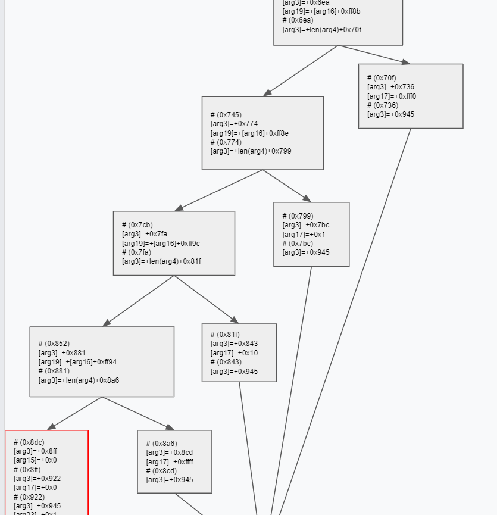

# sprint

Category : Reverse Engineering
Points : 173

Sprint faster than this binary!

https://storage.googleapis.com/gctf-2020-attachments-project/c39e555802aa479765c70804396ea5a55ca69583a8de716cc9f03f238a916cb01850b146a0313e9f684c5b86a164498324e42bd17502dea14ad91f1247c660ad

## Solution

### sprintf-based VM

After debugging the binary, we realized we were dealing with a sprintf-based VM. Its instructions are the format strings within the binary. The VM program was extracted and it is presented below:

```c
%1$00038s%3$hn%1$65498s%1$28672s%9$hn
%1$00074s%3$hn%1$65462s%1$*8$s%7$hn
%1$00108s%3$hn%1$65428s%1$1s%6$hn
%1$00149s%3$hn%1$65387s%1$*8$s%1$2s%7$hn
%1$00183s%3$hn%1$65353s%1$1s%6$hn
%1$00218s%3$hn%1$65318s%1$2s%11$hn
%1$00264s%3$hn%1$65272s%1$*10$s%1$*10$s%17$hn
%1$00310s%3$hn%1$65226s%1$28672s%1$*16$s%7$hn
%1$00347s%3$hn%1$65189s%1$*5$s%15$hn
%14$c%1$00419s%2$c%4$s%1$65499s%3$hn
%1$00430s%3$hn%1$65106s%1$*10$s%1$*10$s%13$hn
%1$00468s%3$hn%1$65068s%1$65519s%7$hn
%1$00505s%3$hn%1$65031s%1$*12$s%6$hn
%1$00543s%3$hn%1$64993s%1$65520s%7$hn
%1$00580s%3$hn%1$64956s%1$*5$s%15$hn
%14$c%1$00186s%2$c%4$s%1$00429s%3$hn
%1$00663s%3$hn%1$64873s%1$*12$s%1$*12$s%17$hn
%1$00709s%3$hn%1$64827s%1$28672s%1$*16$s%7$hn
%1$00743s%3$hn%1$64793s%1$1s%6$hn
%1$00789s%3$hn%1$64747s%1$*12$s%1$*10$s%13$hn
%1$00430s%3$hn
%1$00847s%3$hn%1$64689s%1$*10$s%1$1s%11$hn
%10$c%1$64869s%2$c%4$s%1$01549s%3$hn
%1$00922s%3$hn%1$64614s%1$57344s%9$hn
%1$00957s%3$hn%1$64579s%1$0s%11$hn
%1$00993s%3$hn%1$64543s%1$*8$s%7$hn
%1$01030s%3$hn%1$64506s%1$*5$s%13$hn
%12$c%1$00014s%2$c%4$s%1$01051s%3$hn
%1$01185s%3$hn
%1$01129s%3$hn%1$64407s%1$*10$s%1$65535s%11$hn
%1$01170s%3$hn%1$64366s%1$*8$s%1$1s%9$hn
%1$00957s%3$hn
%1$01232s%3$hn%1$64304s%1$*10$s%1$00254s%17$hn
%16$c%1$00014s%2$c%4$s%1$01253s%3$hn
%1$01334s%3$hn
%1$01319s%3$hn%1$64217s%1$5s%23$hn
%1$05081s%3$hn
%1$01368s%3$hn%1$64168s%1$0s%9$hn
%1$01403s%3$hn%1$64133s%1$0s%11$hn
%1$01441s%3$hn%1$64095s%1$61696s%7$hn
%1$01478s%3$hn%1$64058s%1$*5$s%13$hn
%1$01513s%3$hn%1$64023s%1$1s%15$hn
%1$01548s%3$hn%1$63988s%1$0s%23$hn
%1$01593s%3$hn%1$63943s%1$57344s%1$*8$s%7$hn
%1$01630s%3$hn%1$63906s%1$*5$s%17$hn
%16$c%1$00014s%2$c%4$s%1$01651s%3$hn
%1$03479s%3$hn
%1$01723s%3$hn%1$63813s%1$*8$s%1$1s%9$hn
%1$01770s%3$hn%1$63766s%1$*16$s%1$65419s%19$hn
%18$c%1$00053s%2$c%4$s%1$01752s%3$hn
%1$01846s%3$hn%1$63690s%1$65520s%17$hn
%1$02373s%3$hn
%1$01908s%3$hn%1$63628s%1$*16$s%1$65422s%19$hn
%18$c%1$00049s%2$c%4$s%1$01894s%3$hn
%1$01980s%3$hn%1$63556s%1$1s%17$hn
%1$02373s%3$hn
%1$02042s%3$hn%1$63494s%1$*16$s%1$65436s%19$hn
%18$c%1$00050s%2$c%4$s%1$02027s%3$hn
%1$02115s%3$hn%1$63421s%1$16s%17$hn
%1$02373s%3$hn
%1$02177s%3$hn%1$63359s%1$*16$s%1$65428s%19$hn
%18$c%1$00053s%2$c%4$s%1$02159s%3$hn
%1$02253s%3$hn%1$63283s%1$65535s%17$hn
%1$02373s%3$hn
%1$02303s%3$hn%1$63233s%1$0s%15$hn
%1$02338s%3$hn%1$63198s%1$0s%17$hn
%1$02373s%3$hn%1$63163s%1$1s%23$hn
%1$02419s%3$hn%1$63117s%1$*12$s%1$*16$s%13$hn
%1$02457s%3$hn%1$63079s%1$65519s%7$hn
%1$02494s%3$hn%1$63042s%1$*12$s%6$hn
%1$02532s%3$hn%1$63004s%1$65520s%7$hn
%1$02569s%3$hn%1$62967s%1$*5$s%17$hn
%16$c%1$00822s%2$c%4$s%1$01782s%3$hn
%1$02652s%3$hn%1$62884s%1$61440s%1$*12$s%7$hn
%1$02689s%3$hn%1$62847s%1$*5$s%17$hn
%1$02727s%3$hn%1$62809s%1$65519s%7$hn
%1$02764s%3$hn%1$62772s%1$*16$s%6$hn
%1$02802s%3$hn%1$62734s%1$65520s%7$hn
%1$02836s%3$hn%1$62700s%1$0s%6$hn
%1$02874s%3$hn%1$62662s%1$65519s%7$hn
%1$02911s%3$hn%1$62625s%1$*5$s%17$hn
%1$02957s%3$hn%1$62579s%1$*16$s%1$*16$s%17$hn
%1$03003s%3$hn%1$62533s%1$28672s%1$*16$s%7$hn
%1$03040s%3$hn%1$62496s%1$*5$s%17$hn
%16$c%1$00266s%2$c%4$s%1$02809s%3$hn
%1$03120s%3$hn%1$62416s%1$*10$s%1$1s%17$hn
%1$03166s%3$hn%1$62370s%1$61698s%1$*16$s%7$hn
%1$03203s%3$hn%1$62333s%1$*5$s%17$hn
%1$03249s%3$hn%1$62287s%1$*16$s%1$*12$s%17$hn
%16$c%1$00042s%2$c%4$s%1$03242s%3$hn
%1$03329s%3$hn%1$62207s%1$*10$s%1$1s%11$hn
%1$01548s%3$hn
%1$03379s%3$hn%1$62157s%1$0s%15$hn
%1$03414s%3$hn%1$62122s%1$2s%23$hn
%1$01548s%3$hn
%1$03464s%3$hn%1$62072s%1$4s%23$hn
%1$65534s%3$hn
%14$c%1$00014s%2$c%4$s%1$03500s%3$hn
%1$05081s%3$hn
%1$03578s%3$hn%1$61958s%1$*10$s%1$65527s%17$hn
%16$c%1$00014s%2$c%4$s%1$03599s%3$hn
%1$03680s%3$hn
%1$03665s%3$hn%1$61871s%1$3s%23$hn
%1$05081s%3$hn
%1$03714s%3$hn%1$61822s%1$0s%9$hn
%1$03749s%3$hn%1$61787s%1$0s%11$hn
%1$03795s%3$hn%1$61741s%1$*8$s%1$65497s%13$hn
%12$c%1$00014s%2$c%4$s%1$03816s%3$hn
%1$04987s%3$hn
%1$03882s%3$hn%1$61654s%1$4s%15$hn
%1$03917s%3$hn%1$61619s%1$0s%13$hn
%1$03963s%3$hn%1$61573s%1$*12$s%1$*12$s%13$hn
%1$04009s%3$hn%1$61527s%1$*12$s%1$*12$s%13$hn
%1$04055s%3$hn%1$61481s%1$57344s%1$*10$s%7$hn
%1$04092s%3$hn%1$61444s%1$*5$s%17$hn
%1$04139s%3$hn%1$61397s%1$*16$s%1$65419s%19$hn
%18$c%1$00014s%2$c%4$s%1$04160s%3$hn
%1$04632s%3$hn
%1$04238s%3$hn%1$61298s%1$*16$s%1$65422s%19$hn
%18$c%1$00057s%2$c%4$s%1$04216s%3$hn
%1$04318s%3$hn%1$61218s%1$*12$s%1$1s%13$hn
%1$04632s%3$hn
%1$04380s%3$hn%1$61156s%1$*16$s%1$65436s%19$hn
%18$c%1$00057s%2$c%4$s%1$04358s%3$hn
%1$04460s%3$hn%1$61076s%1$*12$s%1$2s%13$hn
%1$04632s%3$hn
%1$04522s%3$hn%1$61014s%1$*16$s%1$65428s%19$hn
%18$c%1$00057s%2$c%4$s%1$04500s%3$hn
%1$04602s%3$hn%1$60934s%1$*12$s%1$3s%13$hn
%1$04632s%3$hn
%1$05081s%3$hn
%1$04675s%3$hn%1$60861s%1$*10$s%1$1s%11$hn
%1$04722s%3$hn%1$60814s%1$*14$s%1$65535s%15$hn
%14$c%1$64693s%2$c%4$s%1$05600s%3$hn
%1$04804s%3$hn%1$60732s%1$61708s%1$*8$s%7$hn
%1$04841s%3$hn%1$60695s%1$*5$s%15$hn
%1$04886s%3$hn%1$60650s%1$59392s%1$*8$s%7$hn
%1$04931s%3$hn%1$60605s%1$*14$s%1$*12$s%6$hn
%1$04972s%3$hn%1$60564s%1$*8$s%1$1s%9$hn
%1$03749s%3$hn
%1$05032s%3$hn%1$60504s%1$59392s%1$*8$s%7$hn
%1$05066s%3$hn%1$60470s%1$0s%6$hn
%1$65534s%3$hn
%1$05119s%3$hn%1$60417s%1$59392s%7$hn
%1$05153s%3$hn%1$60383s%1$0s%6$hn
%1$65534s%3$hn
```

We considered that VM has a 0x10000 byte memory which is initialized using mmap. The program is loaded using memcpy. Both functions are executed in the binary main function. The main informations of VM program are:

```
mem_size = 0x10000
start_program - 0x0000
exit_program - 0xfffe
input_addr - 0xe000
correct_bool - 0x7400
flag_addr - 0xe800
```

### Explicit the instructions side-effects


The side-effects of printing each format string instruction were enumerated with the following python3 script.

```python
#!/usr/bin/python3

data = open('formats.txt', 'r').read()

from re import findall
from collections import Counter

lines = data.rstrip('\n').split('\n')

def parse_op(op, index):
    if len(op) == 1:
        if op[0][-1] == 's':
            value = f'{hex(int(op[0][:-1]))}' if len(op[-1]) > 1 else 'len'
            operation = f'+{value}(arg{index})'
        if op[0][-1] == 'n':
            operation = f'[arg{index}]='
        if op[0][-1] == 'c':
            operation = f'+1'

    elif len(op) == 2:
        operation = f'+[arg{op[0][1:]}]'

    return operation

def shorten_cmd(cmd):
    new_cmd = ''
    value = 0
    alt = False
    alt_value = 0
    for operand in cmd.split('+')[1:]:
        if operand[0] == '[':
            new_cmd += f'+{operand}'
        elif operand[0] == 'l':
                alt = True
                alt_value = value-1
        else:
            value += int(operand.split('(')[0], 16)
    new_cmd += f'+{hex(value & 0xffff)}'
    if alt_value:
        new_cmd += f' | +{hex((value+alt_value) & 0xffff)}'
    return new_cmd

def parse(addr, line):
    fmts = line.lstrip('%').split('%')
    print(f'# ({hex(addr)})')
    cmd = ''
    for fmt in fmts:
        index, *op = fmt.split('$')
        p_op = parse_op(op, index)

        if p_op[-1] == '=':
            print(f'{p_op}{shorten_cmd(cmd)}')
        else:
            cmd += p_op

addr = 0
for line in lines:
    parse(addr, line)
    addr += len(line) + 1
```

Each format string instruction is at address (`# (string_addr)`) and assigns a value into an argument (`[argX]=+expression`). The arguments for the instructions were related to the sprintf arguments.

```
sprintf(
      (char *)0x6000000,
      format,
      &unk_1116A,  // arg1
      0LL,         // arg2
      &format,     // arg3
      0x6000000LL, // arg4
      *v5,         // arg5
      v5,          // arg6
      &v5,         // arg7
      v6,          // arg8
      &v6,         // arg9
      v7,          // arg10
      &v7,         // arg11
      v8,          // arg12
      &v8,         // arg13
      v9,          // arg14
      &v9,         // arg15
      v10,         // arg16
      &v10,        // arg17
      v11,         // arg18
      &v11,        // arg19
      v12,         // arg20
      &v12,        // arg21
      v13,         // arg22
      &v13);       // arg23
```

As arg3 points to `format` (the format string that will be printed), assigning it will change the instruction pointer at the VM. As arg6 points to arg5, assigning arg6 will change arg5 value. The same relation occurs between arg7 and arg6, arg9 and arg8, arg11 and arg10, ... Executing the python3 script generates the following output which explicits the instructions side-effects. The assignments with the pattern `[arg3]=+addrA | addrB` were considered conditional jumps. If the previous assignment was 0, the control flows to `addrA`. Otherwise, it flows to `addrB`.

```
# (0x0)
[arg3]=+0x26
[arg9]=+0x7000
# (0x26)
[arg3]=+0x4a
[arg7]=+[arg8]+0x0
# (0x4a)
[arg3]=+0x6c
[arg6]=+0x1
# (0x6c)
[arg3]=+0x95
[arg7]=+[arg8]+0x2
# (0x95)
[arg3]=+0xb7
[arg6]=+0x1
# (0xb7)
[arg3]=+0xda
[arg11]=+0x2
# (0xda)
[arg3]=+0x108
[arg17]=+[arg10]+[arg10]+0x0
# (0x108)
[arg3]=+0x136
[arg7]=+[arg16]+0x7000
# (0x136)
[arg3]=+0x15b
[arg15]=+[arg5]+0x0
# (0x15b)
[arg3]=+0x180 | +0x324
# (0x180)
[arg3]=+0x1ae
[arg13]=+[arg10]+[arg10]+0x0
# (0x1ae)
[arg3]=+0x1d4
[arg7]=+0xffef
# (0x1d4)
[arg3]=+0x1f9
[arg6]=+[arg12]+0x0
# (0x1f9)
[arg3]=+0x21f
[arg7]=+0xfff0
# (0x21f)
[arg3]=+0x244
[arg15]=+[arg5]+0x0
# (0x244)
[arg3]=+0x269 | +0x324
# (0x269)
[arg3]=+0x297
[arg17]=+[arg12]+[arg12]+0x0
# (0x297)
[arg3]=+0x2c5
[arg7]=+[arg16]+0x7000
# (0x2c5)
[arg3]=+0x2e7
[arg6]=+0x1
# (0x2e7)
[arg3]=+0x315
[arg13]=+[arg12]+[arg10]+0x0
# (0x315)
[arg3]=+0x1ae
# (0x324)
[arg3]=+0x34f
[arg11]=+[arg10]+0x1
# (0x34f)
[arg3]=+0x374 | +0xda
# (0x374)
[arg3]=+0x39a
[arg9]=+0xe000
# (0x39a)
[arg3]=+0x3bd
[arg11]=+0x0
# (0x3bd)
[arg3]=+0x3e1
[arg7]=+[arg8]+0x0
# (0x3e1)
[arg3]=+0x406
[arg13]=+[arg5]+0x0
# (0x406)
[arg3]=+0x42b | +0x43a
# (0x42b)
[arg3]=+0x4a1
# (0x43a)
[arg3]=+0x469
[arg11]=+[arg10]+0xffff
# (0x469)
[arg3]=+0x492
[arg9]=+[arg8]+0x1
# (0x492)
[arg3]=+0x3bd
# (0x4a1)
[arg3]=+0x4d0
[arg17]=+[arg10]+0xfe
# (0x4d0)
[arg3]=+0x4f5 | +0x504
# (0x4f5)
[arg3]=+0x536
# (0x504)
[arg3]=+0x527
[arg23]=+0x5
# (0x527)
[arg3]=+0x13d9
# (0x536)
[arg3]=+0x558
[arg9]=+0x0
# (0x558)
[arg3]=+0x57b
[arg11]=+0x0
# (0x57b)
[arg3]=+0x5a1
[arg7]=+0xf100
# (0x5a1)
[arg3]=+0x5c6
[arg13]=+[arg5]+0x0
# (0x5c6)
[arg3]=+0x5e9
[arg15]=+0x1
# (0x5e9)
[arg3]=+0x60c
[arg23]=+0x0
# (0x60c)
[arg3]=+0x639
[arg7]=+[arg8]+0xe000
# (0x639)
[arg3]=+0x65e
[arg17]=+[arg5]+0x0
# (0x65e)
[arg3]=+0x683 | +0x692
# (0x683)
[arg3]=+0xd97
# (0x692)
[arg3]=+0x6bb
[arg9]=+[arg8]+0x1
# (0x6bb)
[arg3]=+0x6ea
[arg19]=+[arg16]+0xff8b
# (0x6ea)
[arg3]=+0x70f | +0x745
# (0x70f)
[arg3]=+0x736
[arg17]=+0xfff0
# (0x736)
[arg3]=+0x945
# (0x745)
[arg3]=+0x774
[arg19]=+[arg16]+0xff8e
# (0x774)
[arg3]=+0x799 | +0x7cb
# (0x799)
[arg3]=+0x7bc
[arg17]=+0x1
# (0x7bc)
[arg3]=+0x945
# (0x7cb)
[arg3]=+0x7fa
[arg19]=+[arg16]+0xff9c
# (0x7fa)
[arg3]=+0x81f | +0x852
# (0x81f)
[arg3]=+0x843
[arg17]=+0x10
# (0x843)
[arg3]=+0x945
# (0x852)
[arg3]=+0x881
[arg19]=+[arg16]+0xff94
# (0x881)
[arg3]=+0x8a6 | +0x8dc
# (0x8a6)
[arg3]=+0x8cd
[arg17]=+0xffff
# (0x8cd)
[arg3]=+0x945
# (0x8dc)
[arg3]=+0x8ff
[arg15]=+0x0
# (0x8ff)
[arg3]=+0x922
[arg17]=+0x0
# (0x922)
[arg3]=+0x945
[arg23]=+0x1
# (0x945)
[arg3]=+0x973
[arg13]=+[arg12]+[arg16]+0x0
# (0x973)
[arg3]=+0x999
[arg7]=+0xffef
# (0x999)
[arg3]=+0x9be
[arg6]=+[arg12]+0x0
# (0x9be)
[arg3]=+0x9e4
[arg7]=+0xfff0
# (0x9e4)
[arg3]=+0xa09
[arg17]=+[arg5]+0x0
# (0xa09)
[arg3]=+0xa2e | +0xd65
# (0xa2e)
[arg3]=+0xa5c
[arg7]=+[arg12]+0xf000
# (0xa5c)
[arg3]=+0xa81
[arg17]=+[arg5]+0x0
# (0xa81)
[arg3]=+0xaa7
[arg7]=+0xffef
# (0xaa7)
[arg3]=+0xacc
[arg6]=+[arg16]+0x0
# (0xacc)
[arg3]=+0xaf2
[arg7]=+0xfff0
# (0xaf2)
[arg3]=+0xb14
[arg6]=+0x0
# (0xb14)
[arg3]=+0xb3a
[arg7]=+0xffef
# (0xb3a)
[arg3]=+0xb5f
[arg17]=+[arg5]+0x0
# (0xb5f)
[arg3]=+0xb8d
[arg17]=+[arg16]+[arg16]+0x0
# (0xb8d)
[arg3]=+0xbbb
[arg7]=+[arg16]+0x7000
# (0xbbb)
[arg3]=+0xbe0
[arg17]=+[arg5]+0x0
# (0xbe0)
[arg3]=+0xc05 | +0xd10
# (0xc05)
[arg3]=+0xc30
[arg17]=+[arg10]+0x1
# (0xc30)
[arg3]=+0xc5e
[arg7]=+[arg16]+0xf102
# (0xc5e)
[arg3]=+0xc83
[arg17]=+[arg5]+0x0
# (0xc83)
[arg3]=+0xcb1
[arg17]=+[arg16]+[arg12]+0x0
# (0xcb1)
[arg3]=+0xcd6 | +0xd01
# (0xcd6)
[arg3]=+0xd01
[arg11]=+[arg10]+0x1
# (0xd01)
[arg3]=+0x60c
# (0xd10)
[arg3]=+0xd33
[arg15]=+0x0
# (0xd33)
[arg3]=+0xd56
[arg23]=+0x2
# (0xd56)
[arg3]=+0x60c
# (0xd65)
[arg3]=+0xd88
[arg23]=+0x4
# (0xd88)
[arg3]=+0xfffe
# (0xd97)
[arg3]=+0xdbc | +0xdcb
# (0xdbc)
[arg3]=+0x13d9
# (0xdcb)
[arg3]=+0xdfa
[arg17]=+[arg10]+0xfff7
# (0xdfa)
[arg3]=+0xe1f | +0xe2e
# (0xe1f)
[arg3]=+0xe60
# (0xe2e)
[arg3]=+0xe51
[arg23]=+0x3
# (0xe51)
[arg3]=+0x13d9
# (0xe60)
[arg3]=+0xe82
[arg9]=+0x0
# (0xe82)
[arg3]=+0xea5
[arg11]=+0x0
# (0xea5)
[arg3]=+0xed3
[arg13]=+[arg8]+0xffd9
# (0xed3)
[arg3]=+0xef8 | +0xf07
# (0xef8)
[arg3]=+0x137b
# (0xf07)
[arg3]=+0xf2a
[arg15]=+0x4
# (0xf2a)
[arg3]=+0xf4d
[arg13]=+0x0
# (0xf4d)
[arg3]=+0xf7b
[arg13]=+[arg12]+[arg12]+0x0
# (0xf7b)
[arg3]=+0xfa9
[arg13]=+[arg12]+[arg12]+0x0
# (0xfa9)
[arg3]=+0xfd7
[arg7]=+[arg10]+0xe000
# (0xfd7)
[arg3]=+0xffc
[arg17]=+[arg5]+0x0
# (0xffc)
[arg3]=+0x102b
[arg19]=+[arg16]+0xff8b
# (0x102b)
[arg3]=+0x1050 | +0x105f
# (0x1050)
[arg3]=+0x1218
# (0x105f)
[arg3]=+0x108e
[arg19]=+[arg16]+0xff8e
# (0x108e)
[arg3]=+0x10b3 | +0x10ed
# (0x10b3)
[arg3]=+0x10de
[arg13]=+[arg12]+0x1
# (0x10de)
[arg3]=+0x1218
# (0x10ed)
[arg3]=+0x111c
[arg19]=+[arg16]+0xff9c
# (0x111c)
[arg3]=+0x1141 | +0x117b
# (0x1141)
[arg3]=+0x116c
[arg13]=+[arg12]+0x2
# (0x116c)
[arg3]=+0x1218
# (0x117b)
[arg3]=+0x11aa
[arg19]=+[arg16]+0xff94
# (0x11aa)
[arg3]=+0x11cf | +0x1209
# (0x11cf)
[arg3]=+0x11fa
[arg13]=+[arg12]+0x3
# (0x11fa)
[arg3]=+0x1218
# (0x1209)
[arg3]=+0x13d9
# (0x1218)
[arg3]=+0x1243
[arg11]=+[arg10]+0x1
# (0x1243)
[arg3]=+0x1272
[arg15]=+[arg14]+0xffff
# (0x1272)
[arg3]=+0x1297 | +0xf4d
# (0x1297)
[arg3]=+0x12c4
[arg7]=+[arg8]+0xf10c
# (0x12c4)
[arg3]=+0x12e9
[arg15]=+[arg5]+0x0
# (0x12e9)
[arg3]=+0x1316
[arg7]=+[arg8]+0xe800
# (0x1316)
[arg3]=+0x1343
[arg6]=+[arg14]+[arg12]+0x0
# (0x1343)
[arg3]=+0x136c
[arg9]=+[arg8]+0x1
# (0x136c)
[arg3]=+0xea5
# (0x137b)
[arg3]=+0x13a8
[arg7]=+[arg8]+0xe800
# (0x13a8)
[arg3]=+0x13ca
[arg6]=+0x0
# (0x13ca)
[arg3]=+0xfffe
# (0x13d9)
[arg3]=+0x13ff
[arg7]=+0xe800
# (0x13ff)
[arg3]=+0x1421
[arg6]=+0x0
# (0x1421)
[arg3]=+0xfffe
```

### CFG analysis

The instructions were analyzed and a Control Flow Graph was designed based on it to have a better understanding of how the VM program behaves.


#### Valid chars

Analyzing the following part of the CFG, we found out that the input string should have only the 'u', 'r', 'd' and 'l' characteres. The success exit block is marked green, while the fail blocks are marked red.


Any character different from them in the input would lead the execution to a fail exit block.


#### There is a map

Analyzing the following part of the CFG, we figured out that each character is substituted by a different integer value ('u' is substituted by -16, 'r' is substituted by 1, 'd' is substituted by 16 and 'l' is substituted by -1). This substitution pattern made us suspect that we were dealing the a map of 16 columns and each character represents a move within this map.



#### Valid positions (maze)

Analyzing the following part of the CFG, we figured out that not all positions were valid. So we were dealing with a maze represented by a buffer starting at 0xf000 address. The validity of each coordinate is checked using the code at the position against the buffer starting at 0x7000 address.


The validity buffer is setup at the beginning the VM program.


#### Collect gems

Analyzing the following part of the CFG, we figured out that we should collect gems present in the maze. The collecting must occur in a predefined order.


#### Gems collection

Analyzing the following part of the CFG, we figured out that we should collect 9 gems while moving inside the maze.


#### Maze start

Analyzing the following part of the CFG, we figured out that the start position is (1,1).


#### Analysis conclusion

After analyzing the CFG, we realized that the VM program expects the steps used as input represents walking within the maze and getting all the 9 gems in the expected order. We extracted what we need from the binary and used the following script to print the maze so we could visualize what we are facing.

```python
#!/usr/bin/python3

from pwn import *

blocks = [' ', '#']

mem_7000 = [0x0001,0x0001,0x0000,0x0000,0x0001,0x0000,0x0001,0x0000,0x0001,0x0001,0x0001,0x0000,0x0001,0x0000,0x0001,0x0001,0x0001,0x0000,0x0001,0x0000,0x0001,0x0001,0x0001,0x0000,0x0001,0x0001,0x0001,0x0001,0x0001,0x0000,0x0001,0x0000,0x0001,0x0001,0x0001,0x0001,0x0001,0x0000,0x0001,0x0001,0x0001,0x0000,0x0001,0x0000,0x0001,0x0001,0x0001,0x0000,0x0001,0x0001,0x0001,0x0001,0x0001,0x0000,0x0001,0x0001,0x0001,0x0001,0x0001,0x0000,0x0001,0x0000,0x0001,0x0001,0x0001,0x0001,0x0001,0x0000,0x0001,0x0001,0x0001,0x0000,0x0001,0x0000,0x0001,0x0001,0x0001,0x0001,0x0001,0x0000,0x0001,0x0001,0x0001,0x0000,0x0001,0x0001,0x0001,0x0001,0x0001,0x0000,0x0001,0x0001,0x0001,0x0001,0x0001,0x0001,0x0001,0x0000,0x0001,0x0001,0x0001,0x0000,0x0001,0x0000,0x0001,0x0001,0x0001,0x0000,0x0001,0x0000,0x0001,0x0001,0x0001,0x0000,0x0001,0x0001,0x0001,0x0001,0x0001,0x0001,0x0001,0x0001,0x0001,0x0001,0x0001,0x0001,0x0001,0x0000,0x0001,0x0001,0x0001,0x0000,0x0001,0x0001,0x0001,0x0001,0x0001,0x0000,0x0001,0x0000,0x0001,0x0001,0x0001,0x0001,0x0001,0x0001,0x0001,0x0001,0x0001,0x0000,0x0001,0x0000,0x0001,0x0001,0x0001,0x0001,0x0001,0x0000,0x0001,0x0001,0x0001,0x0001,0x0001,0x0000,0x0001,0x0001,0x0001,0x0000,0x0001,0x0001,0x0001,0x0001,0x0001,0x0000,0x0001,0x0001,0x0001,0x0001,0x0001,0x0000,0x0001,0x0000,0x0001,0x0001,0x0001,0x0001,0x0001,0x0001,0x0001,0x0001,0x0001,0x0000,0x0001,0x0000,0x0001,0x0001,0x0001,0x0000,0x0001,0x0000,0x0001,0x0001,0x0001,0x0001,0x0001,0x0001,0x0001,0x0001,0x0001,0x0001,0x0001,0x0000,0x0001,0x0001,0x0001,0x0001,0x0001,0x0001,0x0001,0x0001,0x0001,0x0001,0x0001,0x0000,0x0001,0x0001,0x0001,0x0000,0x0001,0x0000,0x0001,0x0001,0x0001,0x0000,0x0001,0x0001,0x0001,0x0001,0x0001,0x0000,0x0001,0x0000,0x0001,0x0001,0x0001,0x0001,0x0001,0x0001,0x0001,0x0001,0x0001,0x0000,0x0001,0x0001,0x0001,0x0001]

gems = open('gems.bin', 'rb').read()

g = {}
for idx in range(10):
    g[0x100 - gems[idx]] = str(idx)

maze = open('maze.bin', 'rb').read()

for r in range(0, len(maze), 16):
    row = []
    for c in range(r, min(r+16, len(maze))):
        cell = blocks[mem_7000[maze[c]]]
        if cell == ' ' and c in g:
            cell = g[c]
        row.append(cell)
    print(''.join(row))
```

### Play maze time

The `print_maze` script outputs the following maze, where `0` points the initial position and `1, 2, ..., 9` point the gem positions we need to collect.

```
################
#0#     #      9
# # ##### ######
#       # # #  6
# ##### # # # ##
#3#5#           
### ### ####### 
#   #8  #   #1  
# ##### ### ####
#       # #   # 
# # ##### # ### 
# # # #4#       
# ### # # # ####
#         #     
### # ##### # ##
#7  # #     #  2
 #  ##   # #####
# ##  #### ## # 
#### #########  
 ###
```

The moves to each gem from the previous position are presented below.

```
1 - ddrrrrrrddrrrrrrrrddll
2 - rruullllllllddddllllllddddrrrrrrrruurrddrrddrr
3 - lluulluullddlllllllluuuurrrrrruuuuuulllllldd
4 - uurrrrrrddddddllllllddddrrrrrruu
5 - ddlllllluuuuuurruu
6 - ddllddrrrrrruuuurrrrrruurr
7 - llddllllllddddllllllddddrrddll
8 - rruulluuuurrrrrruull
9 - rruurruuuurrrrrr
```

After concatenating all the partial solutions, we get following input.

```
ddrrrrrrddrrrrrrrrddllrruullllllllddddllllllddddrrrrrrrruurrddrrddrrlluulluullddlllllllluuuurrrrrruuuuuulllllldduurrrrrrddddddllllllddddrrrrrruuddlllllluuuuuurruuddllddrrrrrruuuurrrrrruurrllddllllllddddllllllddddrrddllrruulluuuurrrrrruullrruurruuuurrrrrr
```

Feeding this string as input to the binary returns the flag.


Flag: `CTF{n0w_ev3n_pr1n7f_1s_7ur1ng_c0mpl3te}`.
